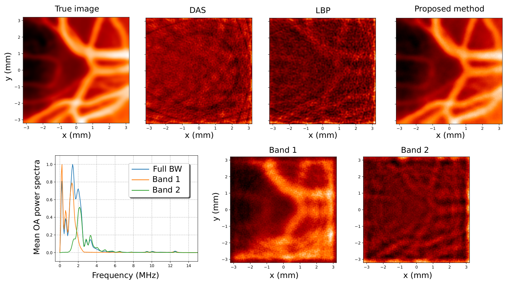

# Optoacoustic Imaging: Combining Band-Frequency Separation and FD-UNet

The oficial pytorch implementation of the paper [Combining banb-frequency separation and deep neural network for optoacoustic imaging](http://arxiv.org/abs/2210.08099)

We proposed an deep FD-UNet architecture that directly exploits the frequency content in the broadband sinogram of an optoacustic measured signal for image reconstruction. The reconstructed images present a high degree of fidelity.


Figure: Reconstruction example. In the second half it is shown the average power spectrum of the full sinogram and the components associated with x1 and x2.

### Citation
If our implementation helps your research work, please consider citing us:

```
@article{gonzalez2022,
  title={Combining banb-frequency separation and deep neural network for optoacoustic imaging},
  author={M. Gonzalez, M. Vera, L. Rey Vega},
  journal={arXiv preprint arXiv:2210.08099},
  year={2022}
}
```

### Contact
If you have any question, please contact mggonza@fi.uba.ar or lrey@fi.uba.ar
